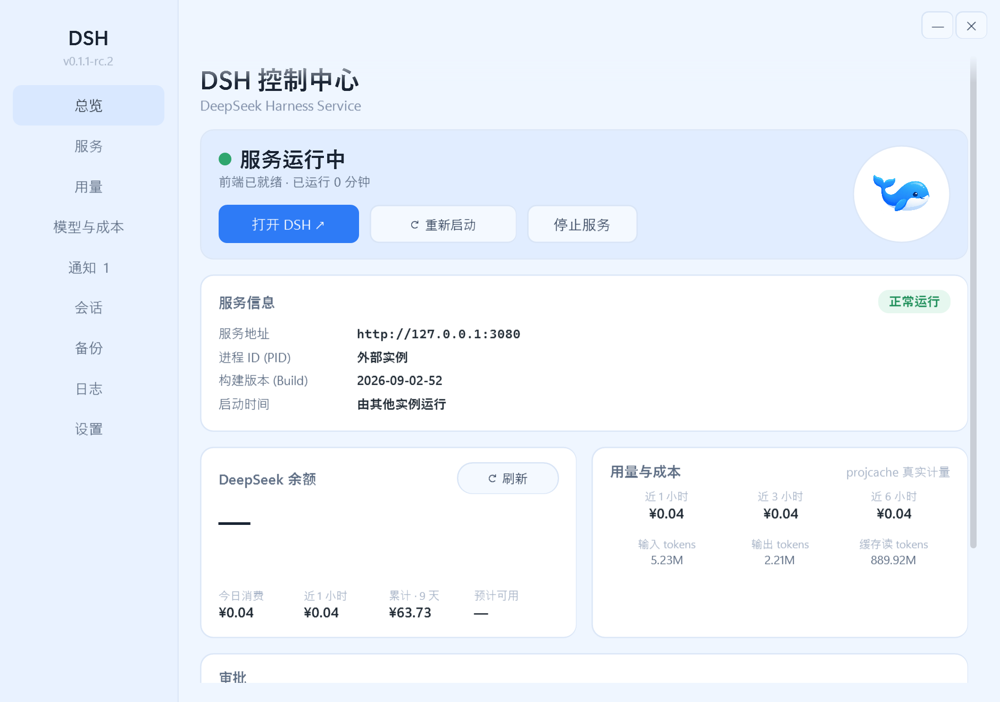
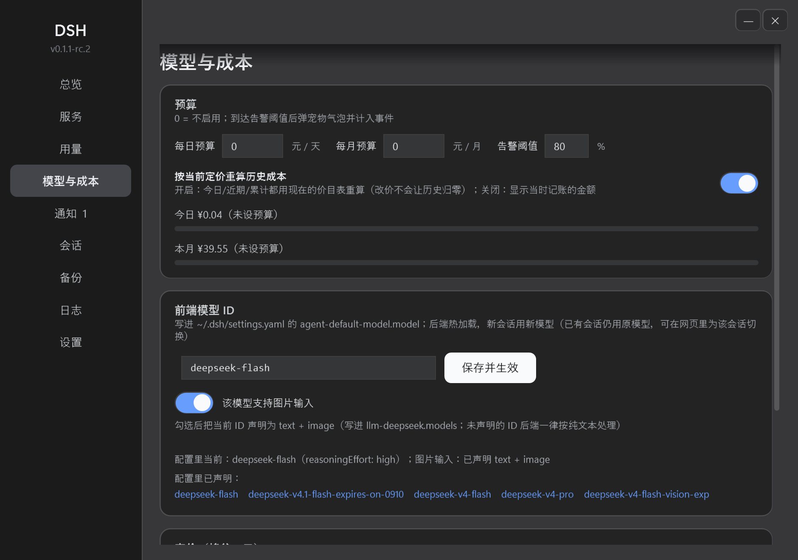
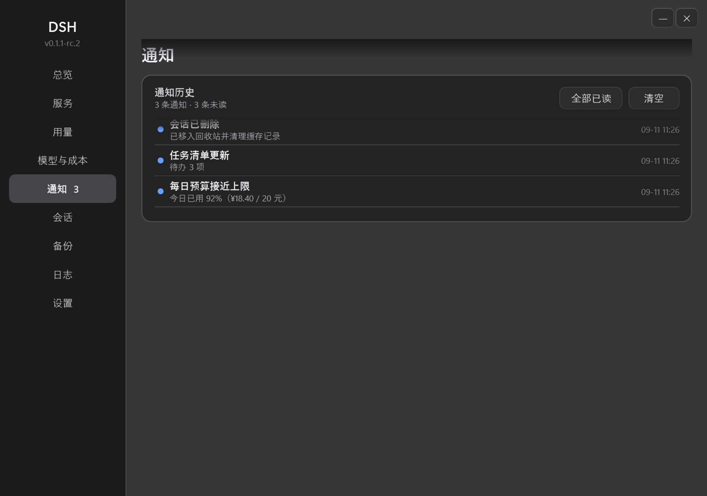
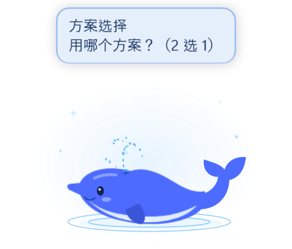

# DSH 控制中心

> **EN** — A portable Windows tray console for a local **DSH** backend (`dsh web`, default `http://127.0.0.1:3080`):
> start/stop the service, see **real token usage and cost**, answer approvals and questions without leaving the
> desktop, browse sessions, back up and restore, and get one-click diagnostics. No installer, no admin rights.

DSH 控制中心的托盘小程序，把本机的 DSH 后端管起来：**服务启停、真实用量与成本、审批与提问提醒、
会话库、备份恢复、诊断包**，桌面上还有一只会喷水的鲸鱼。便携，免安装、免管理员。
界面为中文；后端本体需自备（见[环境要求](#环境要求)）。

## 主要功能

- **服务控制** — 启停/重启本机 `dsh web`，后端隐藏运行、日志进 `logs\dsh-web.log`；外部实例占用 3080 时也能停止（先确认）。后端进程加入 Windows Job 对象，壳崩溃也不会留下孤儿进程。
- **用量与成本** — 直接读后端落盘的 `session_projcache.json`（不改后端）：今日 / 近 1 小时 / 累计·N 天 / 预计可用，近 1·3·6 小时成本与输入、输出、缓存读 tokens。
- **模型与成本** — 一页改「用哪个模型 + 它花多少钱」：改前端模型 ID（写进后端配置，**热加载**，新会话生效）、一键声明该模型是否支持图片输入、编辑高峰时段与各列单价、按现价重算历史成本。
- **通知与托盘** — 任务完成/中断、预算告警、审批、提问都落成通知历史（未读蓝点、点击跳回会话）；托盘图标按服务状态变色，有未读时右上角加红点。
- **审批与提问提醒** — 后端等待审批或模型向你提问时，壳内可直接允许/拒绝；**宠物会举着气泡等你回复**，处理完自动消红点。
- **会话库** — 列出全部会话（时间 · 轮次 · tokens · 成本 · 体积），搜索、导出 zip、原样导入还原；删除进回收站并同步网页列表。
- **备份与诊断** — `~/.dsh` 打包备份（**API 凭据默认不进包**），恢复只补缺失、绝不覆盖；一键生成脱敏诊断包便于排障。
- **桌面宠物** — 矢量移植的鲸鱼喷水动画：速度 0.2–3.0× 可调、任务完成喷到 100%、异常结束只提醒不喷、空闲回到低水花；可拖动、可关闭。

## 环境要求

- **Windows 10 / 11（64 位）**（系统自带 .NET Framework 4.8）。
- 本机已能跑 DSH 后端：仓库**不含**后端本体，`install-dsh.cmd` 会按 `package.json` 用 pnpm 安装 `@deepseek-ai/dsh`（能否拉到取决于你的 registry）。
- 安装时需联网；**不需要**管理员权限、**不需要**预装 Node.js / Python / VS Build Tools。

## 安装

1. 下载本仓库（`Code → Download ZIP`，或 `git clone https://github.com/Sawyer20/DSH-App.git`），解压到任意目录。
2. 双击 **`install-dsh.cmd`**，等它跑完（首次几分钟）：下载便携 Node 到 `.tools\node` → 装本地 pnpm → `pnpm install` 装依赖 → 建桌面快捷方式。
3. 双击桌面 **DSH** 开始用。

> 若目录里放了 `redist\node-*.msi`，脚本会用它离线解包安装；没有就从网上下。
> 装 Node 时**不要勾选 "Tools for Native Modules"**（会拉 Chocolatey + Python + VS Build Tools，本项目用不到）。
> 只改了 `.cs` / 脚本时不必重装：覆盖文件后双击 `build-dsh-exe.cmd` 重建即可，也不需要联网。

## 日常使用

- 双击桌面 **DSH** → 状态窗（服务状态 / 前端地址 / PID / BuildId）→ **「打开 DSH」** 进网页界面。
- 窗口 **×** 只是最小化到托盘，**服务继续跑**；托盘菜单 **「退出（停止服务）」** 才真正停止后端。
- 托盘右键菜单：打开 DSH / 刷新余额 / 停止·启动服务 / 日志 / 通知 / 会话库 / 备份历史 / 模型与成本 / 生成诊断包 / 设置。

## 数据与隐私

| 位置 | 内容 |
|---|---|
| `~/.dsh` | 后端自己的配置、凭据、会话、附件（壳只读；写配置仅在你点「保存并生效」时发生） |
| `%LOCALAPPDATA%\DSH` | 壳自己的数据：价目表、用量历史、通知历史、主题与偏好 |
| `<安装目录>\logs` | 后端日志、备份 zip、诊断包 |

无遥测、无云端上报，所有连接只针对 `127.0.0.1`；备份与诊断包默认不含 API 凭据。

## 常见问题

- **杀毒提示**：右键 `DSH.exe` → 属性 → **解除锁定**；或在本机跑一次 `build-dsh-exe.cmd` 重新生成（本地文件没有"来自其他计算机"标记）。
- **`ECONNRESET` / 下载失败**：网络抖动，重跑 `install-dsh.cmd`（可续传）。镜像 404 就把 `.npmrc` 第一行改成 `registry=https://registry.npmjs.org/`。
- **换电脑**：复制整个文件夹（跳过 `node_modules`、`.tools`、`logs`）；要沿用会话与凭据，另外复制 `~/.dsh`。

## 自己编译

代码级 WPF：无 XAML、无 MSBuild、无第三方库，用系统自带 `csc` 直接编译（C# 5）。源码即真源，`DSH.exe` 只是产物。

| 命令 | 作用 |
|---|---|
| `build-dsh-exe.cmd` | 编译 `DSH.exe`（运行中也安全：旧文件改名 `DSH-old.exe`，下次启动生效） |

改源码的约定：递增 `DSH.cs` 里的 `BuildId` → 重新编译 → 同步本 README 的版本行。

**当前 BuildId：`2026-09-02-52`**

## 许可证

[MIT](LICENSE) © 2026 Sawyer20

## 免责声明

第三方工具，与 DeepSeek 官方无隶属或背书关系；相关名称与素材权利归其所有者。后端本体由使用者自行安装，
其许可与使用条款由提供方决定。请在符合当地法律与服务条款的前提下使用。
