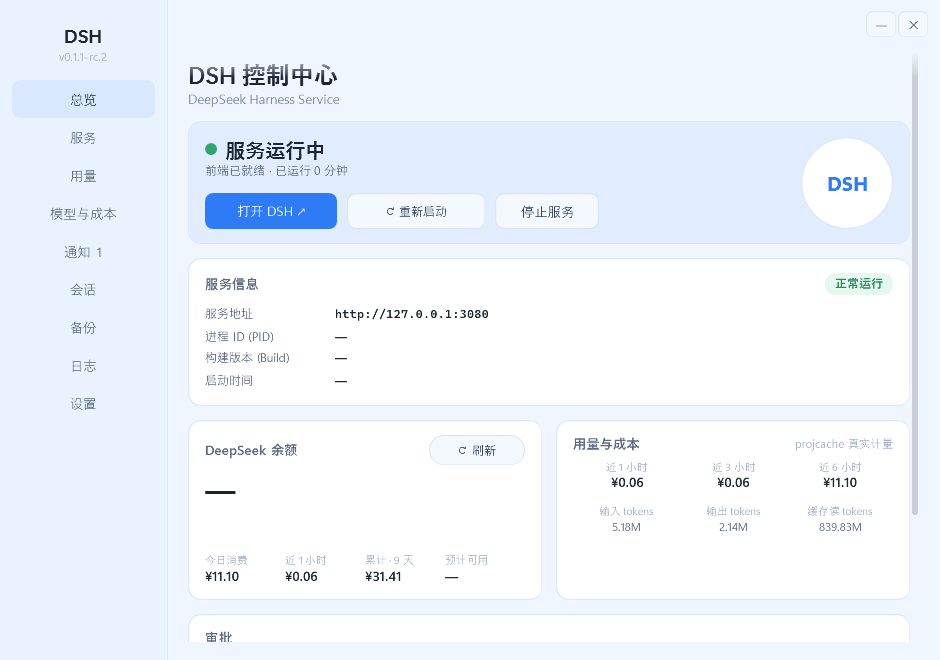

# DSH 控制中心（DSH Tray Console）

> **EN** — A portable Windows tray console for a local **DSH** backend (`dsh web`, default `http://127.0.0.1:3080`).
> One small self-contained WPF app: no installer, no admin rights, no WinForms. It starts/stops the backend,
> shows **real token usage and cost**, and adds a desktop whale pet, notification history with a tray red dot,
> a session library, backup/restore, in-app approval answering and one-click diagnostics.
> UI is currently Chinese only. Backend is **not** included — see [环境要求](#环境要求).

**DSH 控制中心** 是一个托盘小程序，把本机的 DSH 后端（`dsh web`，默认 `127.0.0.1:3080`）管起来：
启动/停止服务、看真实用量与花了多少钱、审批直接在壳里点、通知有历史有红点、会话能导出能删、
备份能打包能还原、出问题一键生成诊断包——桌面上还养了一只鲸鱼，任务开始/结束会喷水提醒。

## 它是什么 / 不是什么

| | |
|---|---|
| ✅ 是 | 后端**旁边**的一个壳：读它落盘的明文投影缓存和事件流，只做**只读观测 + 有限的显式动作**（启动/停止服务、应答审批、改壳自己的配置） |
| ✅ 是 | **便携**的：一个 `.exe` + 一份便携 Node，复制文件夹就能换电脑，不写注册表、不进 Program Files、不需要管理员 |
| ❌ 不是 | **不含 DSH 后端本体**。没有后端，这个壳没有意义（见[环境要求](#环境要求)） |
| ❌ 不是 | 不是 DeepSeek 官方产品，也和官方无隶属关系（见[免责声明](#免责声明)） |
| ❌ 不是 | 不改后端代码、不注入、不需要后端提供任何新接口 |

## 功能

### 服务控制
- 启动 / 停止 / 重启本机 `dsh web`；后端 node **隐藏运行**，输出写入 `logs\dsh-web.log`，全程不弹控制台窗口。
- **外部实例占用 3080 时也能停止**：先弹确认框显示 PID、进程路径、命令行、父进程是否存活，确认后结束整棵进程树。
- **不再产生孤儿后端**：后端子进程启动即加入 Windows **Job 对象**（kill-on-close），本程序无论怎么退出（崩溃、任务管理器结束）内核都会一并结束它。

### 用量与成本（真实数据，不估算）
直接读后端落盘的 `~/.dsh/storages/session_projcache.json`（`tokenUsage.totals`），**不需要改后端、不需要 zstd**：

- 余额卡：今日消费 / 近 1 小时 / 累计 · N 天 / 预计可用；
- 用量卡：近 1/3/6 小时成本 + 输入 / 输出 / 缓存读 tokens；
- 计费口径：**人民币 元 / 百万 tokens**，缓存命中、缓存未命中、输出、缓存写入四项单价 + 峰值倍数；
- **高峰时段**（默认北京时间周一至周五 09:00–12:00、14:00–18:00，可改，其余时段含午休/夜间/周末都是空闲价）；
- **历史成本按当前价目表从 tokens 重算**（可关）：改价、改时段都不会让历史金额归零或错乱；
- 每分钟把增量落 `usage-history.jsonl`，余额刷新失败**不清零**（保留上次成功值并标注）。

### 模型与成本页
一页搞定"用哪个模型 + 它花多少钱"：

- **前端模型 ID**：直接改后端配置 `~/.dsh/settings.yaml` 的 `agent-default-model.model`（后端**热加载**；**新会话**用新模型，已有会话保持原模型，不动它的上下文缓存），保存后价目表行名同步成同一个 ID；
- **该模型支持图片输入**：把该 ID 在 `llm-deepseek.models` 里声明成 `text + image`——**没声明的 ID 后端一律按纯文本处理，发图会被直接拒**；未声明就自动新增条目，两处一趟写完、一次原子落盘，改配置绝不破坏注释与其它分节；
- 预算：每日 / 每月预算 + 告警阈值（进度条正常蓝 / 接近上限黄 / 超限红，0 = 不启用），越线时宠物气泡 + 事件流提醒；
- 定价表可逐列编辑并一键恢复默认；「按当前定价重算历史成本」开关默认开启。

### 通知、托盘、审批
- **通知历史**（最多 500 条）：任务变化、预算告警、审批等待都落盘，未读带蓝点，可全部已读/清空，**点任意一行即已读并跳回对应会话**；回到某会话发言时该会话的通知自动已读。
- **托盘**（原生 Win32 `Shell_NotifyIcon`，零 WinForms 依赖）：左键/双击打开控制台，右键是自绘圆角菜单（打开 DSH / 刷新余额 / 停止·启动 / 日志 / 通知 / 会话库 / 备份历史 / 模型与成本 / 生成诊断包 / 设置 / 退出）。
- 托盘图标按服务状态切换，**有未读时右上角加小红点**（右下角留给状态点：绿/黄/红/灰），tooltip 追加「N 条未读」。
- **壳内审批**：总览页列出后端正在等待批准的工具调用，可直接「拒绝」或「允许一次」，决策走 `POST /api/respond`；**只有挂了 6 秒还没人答的审批才会提醒**（秒答的不打扰），处理完自动清掉对应通知与红点；连不上时回退为"通知 + 引导回网页"，不会静默失败。

### 会话库 / 备份 / 诊断包
- **会话库**：合并投影缓存与 `~/.dsh/sessions` 磁盘文件，列出「时间 · 轮次/步数 · tokens · 成本 · 体积」，支持按标题/id 实时搜索；**导出**为 zip（可**原样导入还原**）；**删除**移入回收站（可还原）并清理缓存行，随后自动重启服务让网页列表同步。
- **备份与迁移**：把 `~/.dsh` 打成 zip（排除可重建的依赖与投影缓存），带 `manifest.json`；**API 凭据默认不进包**，需要时在「备份」页显式开启；恢复**只补缺失、绝不覆盖**，非本程序的归档会被拒绝；保留份数可配（默认 5，超出进回收站）。
- **一键诊断包**：`logs\diagnostics-<时间戳>.zip`，含人可读 `summary.txt` + 环境 / 服务与端口属主 / 进程 / 依赖完整性 / 用量摘要 / 最近事件 / 日志尾部，**已脱敏**（不含 API Key、凭据文件与会话正文，用户名替换为 `<user>`）。

### 桌面宠物
把 DSH 的鲸鱼喷水动画**矢量移植**到 WPF：透明置顶小窗漂浮在桌面，拖动可移动（位置记忆）、双击开控制台、右键＝托盘同款菜单、服务停止时闭眼"睡觉"。

- 任务/计划变化与"可能等待审批"用**气泡**弹出并引导回网页确认；
- 可调**速度**（0.2–3.0×）与**工作时水花**（0–60%）：任务完成喷到 100% 持续 10 秒、其它提醒 80%、**异常结束/中断只提醒不喷**（水花平滑退回无任务档，约 2 秒）、**审批提醒一直挂着直到你处理**，空闲时回落到 12% 以下；
- 「工作中」由投影缓存的 `openStep` 判定，3 秒一采样；分级帧率（提醒/工作/空闲 = 60/45/30 fps）把常驻开销压到单核 10–16%。

## 环境要求

- **Windows 10 / 11（64 位）**；自带 .NET Framework 4.8（系统已含）。
- **本机已能跑 DSH 后端**：仓库**不含**后端本体，`install-dsh.cmd` 会按 `package.json` 用 pnpm 安装 `@deepseek-ai/dsh`——能否拉到取决于你的 registry（`.npmrc` 默认指向 npmmirror 镜像，可改）。
- 安装时**需要联网**（只有依赖需要下载；Node.js 可离线）。
- **不需要**管理员权限、**不需要**预装 Node.js / pnpm、**不需要** Visual Studio Build Tools / Python（原生模块都是随包提供的 win32-x64 预编译二进制）。
- 界面目前**只有中文**。

## 安装

### 方式 A：下载后用脚本装（推荐）

1. 下载本仓库（`Code → Download ZIP`，或 `git clone https://github.com/Sawyer20/DSH-App.git`），解压到**任意目录**（路径里带中文/空格也可以）。
2. **双击 `install-dsh.cmd`**，等它跑完（首次几分钟）：
   - 检查 / 下载**便携 Node.js** 到 `.tools\node`（不装进系统、不写 PATH）；
   - 在 `.tools\pnpm-home` 装一份**本地 pnpm**（不用 `-g`）；
   - 用镜像源 `pnpm install` 装依赖；
   - 在桌面创建 **DSH** 快捷方式（指向 `DSH.exe`）。
3. 双击桌面 **DSH** 开始用。

> 如果目录里有 `redist\node-*.msi`（自备的 Node 安装包），脚本会用 `msiexec /a` **便携解包**它（不装进系统、不需要管理员）；没有就从网上下便携 Node。
> ⚠️ 无论哪种方式，装 Node 时都**不要勾选 "Tools for Native Modules"**——它会额外下载 Chocolatey + Python + VS Build Tools（数 GB、要管理员），而本项目原生模块全是预编译二进制，装了没用。

### 方式 B：只更新不重装

只改了 `.cs` / 脚本 / 图标时，直接把改动文件覆盖过去，双击 **`build-dsh-exe.cmd`** 本地重建即可，**不需要联网**（用系统自带 csc 编译）。
依赖清单（`package.json` / `pnpm-lock.yaml`）变了才需要重跑 `install-dsh.cmd`。

## 日常使用

1. 双击桌面 DSH → 弹出状态窗（服务状态 / 前端地址 / PID / 运行时长 / BuildId）。
2. 点 **「打开 DSH」** 打开网页界面；服务停止时窗口上的按钮可启动/重启。
3. 窗口 **×** = **最小化到托盘，服务继续跑**；只有托盘菜单 **「退出（停止服务）」** 才真正停后端并退出。
4. 想沿用另一台机器的账号/会话/API 配置：把 `C:\Users\<用户名>\.dsh` 整个复制过去（**不随本文件夹迁移**）。

## 数据放在哪里 / 隐私

| 位置 | 内容 |
|---|---|
| `~/.dsh`（`C:\Users\<用户名>\.dsh`） | 后端自己的配置、凭据、会话、附件（本程序只读；写配置只在你点「保存并生效」时发生） |
| `%LOCALAPPDATA%\DSH\` | **壳自己的**数据：`pricing.json`（价目表）、`usage-history.jsonl` / `usage-state.json`（用量与累计）、`notifications.jsonl`（通知历史）、`ui-settings.txt`（主题、宠物、预算等偏好） |
| `<安装目录>\logs\` | 后端日志、备份 zip、诊断包 |

- **没有任何遥测、没有云端上报**，程序不向任何服务器发送数据；联网只发生在 `install-dsh.cmd`（下载 Node/pnpm/依赖）和你想打开网页界面时。
- 所有网络监听/连接都只针对 `127.0.0.1`；壳不监听任何端口。
- 备份与诊断包默认**不含 API 凭据**，诊断包内容已脱敏。

## 常见问题

- **杀毒/Defender 提示**：常见诱因是脚本 + 联网下载 + 文件带"来自其他计算机"标记。日常使用已不经过脚本执行；必要三步：
  ① 右键 `DSH.exe` / `.cmd` → 属性 → 勾选**解除锁定**；② 在本机双击一次 `build-dsh-exe.cmd` 本地重建（本地生成的文件没有 MOTW 标记，最干净）；③ 信任本目录时把它加进 Windows 安全中心排除项。
- **提示"你正在运行来自其他计算机的文件"**：右键 → 属性 → **解除锁定**。
- **`ECONNRESET` / 下载失败**：多为网络抖动，直接重跑 `install-dsh.cmd`（可续传）。
- **镜像 404（版本未同步）**：把 `.npmrc` 第一行临时改成 `registry=https://registry.npmjs.org/` 再重跑。
- **`build-dsh-exe.cmd` 报"文件被占用"**：DSH 还在运行，托盘「退出」后再试（脚本本身支持运行中换位，通常不会失败）。
- **托盘图标/宠物不见了**：最小化到托盘后按 `Win` 键搜索"DSH"重新打开；宠物在设置页可开关。

## 自己编译（可选）

程序是**代码级 WPF**：无 XAML 文件、无 MSBuild、无第三方库，用 .NET Framework 自带的 `csc` 直接编译（C# 5 语法）。
所有 UI 都是代码构造的，所以仓库里的源码就是唯一真源，`DSH.exe` 只是它的编译产物。

| 命令 | 作用 |
|---|---|
| `build-dsh-exe.cmd` | 编译 `DSH.exe`（**运行中也安全**：旧文件自动改名 `DSH-old.exe`，下次启动即新版） |

建议在本机编译一次：本机生成的文件没有"来自其他计算机"标记，能顺带消掉"未知发布者"提示。

改源码的约定：**递增 `DSH.cs` 里的 `BuildId` → 重新编译 → 同步本 README 的 BuildId 行**。

> 本仓库只放**能跑起来的东西**（源码、安装/构建脚本、图标、依赖清单、`DSH.exe`、文档、截图）。
> 作者本地的开发与发布工具——无界面冒烟断言（50 项）、离屏渲染出图比对、一次性迁移脚本、图标生成脚本、
> 发布打包脚本——以及不公开的工程文档（架构、排障、已知坑、变更记录、ADR）都**不随仓库发布**。

## 目录说明

| 文件 / 目录 | 作用 |
|---|---|
| `DSH.exe` | 托盘壳本体（也可删除后用 `build-dsh-exe.cmd` 重建） |
| `*.cs` | 源码：`DSH.cs`（程序/服务/余额）、`WpfUI.cs`（全部 UI）、`Usage.cs`（用量成本）、`TrayNative.cs`（原生托盘）、`Mux.cs`（事件下行与审批）、`Sessions.cs`、`Backup.cs`、`Notifications.cs`、`PetScene.cs`/`PetWindow.cs`、`Diagnostics.cs`、`Settings.cs`、`Win11Backdrop.cs`、`JobKill.cs` |
| `install-dsh.cmd` + `setup.ps1` | 首次安装（便携 Node/pnpm → 装依赖 → 建快捷方式） |
| `start-dsh.cmd` | 备用控制台启动器（无法编译 exe 时救急） |
| `make-shortcut.ps1` | 重建桌面快捷方式 |
| `build-dsh-exe.cmd` | 用系统自带 csc 重新编译 `DSH.exe` |
| `app.ico` / `DSH.ico` / `tray_*.ico` / `whale_base.png` | 图标与界面 Logo |
| `package.json` / `pnpm-lock.yaml` / `pnpm-workspace.yaml` / `.npmrc` / `app.manifest` | 后端依赖、镜像源与 DPI 清单（勿删） |
| `screenshots/` | 本 README 用的界面截图 |

## 版本

**当前 BuildId：`2026-09-02-51`**（在 `DSH.cs`、状态窗与本行保持一致；每次改源码都会递增）。
核对两台机器是否同版：看状态窗的 BuildId 是否一致；不一致就在那台机器上跑一次 `build-dsh-exe.cmd`。

## 许可证

[MIT](LICENSE) © 2026 Sawyer20

## 免责声明

- 本项目是**第三方工具**，与 DeepSeek 官方**没有隶属、赞助或背书关系**；"DeepSeek"、鲸鱼形象等名称与素材的权利归其所有者，
  本仓库仅在与官方后端互操作的意义上引用它们。
- 后端本体（`@deepseek-ai/dsh`）由使用者自行获取与安装，其许可与使用条款由该项目的提供方决定。
- 请在符合你所在地区法律与相关服务条款的前提下使用；因使用本程序产生的任何后果由使用者自行承担。
